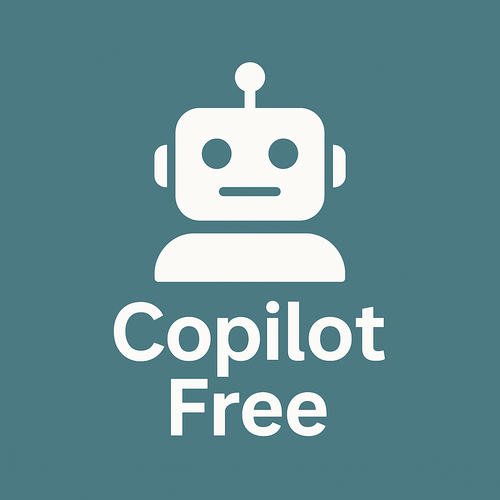

<p align="center">
    
</p>
<div align="center">
    <b>Assistente de código IA offline</b> / <b>Offline AI Code Assistant</b>
</div>

---

## 📥 Baixando o Repositório / Cloning the Repository

1. **Clone o repositório** / **Clone the repository**:
    ```bash
    git clone https://github.com/Lucas-Brum/copilot_free.git
    ```

---

## 🐍 Ambiente Virtual / Virtual Environment

> 🔄 Recomenda-se criar um ambiente virtual com **Python 3.8** para isolar as dependências do projeto.  
> 🔄 It is recommended to create a virtual environment with **Python 3.8** to isolate the project dependencies.

1. **Crie o ambiente virtual** / **Create the virtual environment**:
    ```bash
    python3 -m venv venv
    ```

2. **Ative o ambiente virtual** / **Activate the virtual environment**:
    - No **Linux/MacOS** / On **Linux/MacOS**:
        ```bash
        source venv/bin/activate
        ```
    - No **Windows** / On **Windows**:
        ```bash
        venv\Scripts\activate
        ```

3. **Instale as dependências** / **Install the dependencies**:
    ```bash
    pip install -r requirements.txt
    ```

---

## 🤖 Instalar o Ollama / Install Ollama

4. **Instale o Ollama se ainda não tiver**  
   **Install Ollama if you haven't already**:

    👉 [https://ollama.com/download](https://ollama.com/download)

5. **Instale o modelo que deseja usar**  
   **Install the model you want to use**:

    👉 [https://ollama.com/search](https://ollama.com/search)

---

## ⚙️ Configuração / Configuration

6. **Crie um arquivo `settings.txt` com as configurações abaixo**  
   **Create a `settings.txt` file with the settings below**:
    ```bash
    OLLAMA_URL = http://localhost:11434/api/generate
    MODEL_NAME = qwen2.5:3b
    ```

---

✅ **Pronto para usar!**  
✅ **Ready to use!**
